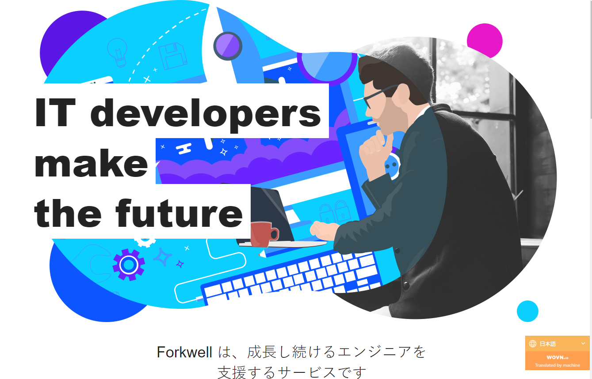

# はんなり Python の会

---

## はんなりPythonの会

## #32 LT会

### 2020/09/18

---

## 活動内容

- 毎月第 3 金曜日に勉強会開催
- https://hannari-python.connpass.com/

---

## 目的

- はんなり交流しましょう(交流のハブになる)
- オープンでフラットなプログラミングコミュニティ
- 初心者からエキスパートまで集まれる
- 持続可能なコミュニティ作り

---

## 行動規範

- PyCon2020 準拠
- [https://pycon.jp/2019/code-of-conduct.html](https://pycon.jp/2019/code-of-conduct.html)
- ハラスメント行為はやめましょう
- カメラの映り込みに注意

---

## スポンサー

- https://forkwell.com/

---

## お子さまOK

- お子様やペットなどの映り込みOKです
- 女性参加のハードルを下げたい試み
- オフラインでの子連れ参加へ

---

## 投げ銭のお願い

- 運営費
- Zoomライセンス料

- [2020年はんなりPythonの会はこう変わる](https://hannaripython.hatenadiary.com/entry/2020/02/01/2020%E5%B9%B4_%E3%81%AF%E3%82%93%E3%81%AA%E3%82%8APython%E3%81%AE%E4%BC%9A%E3%81%AF%E3%81%93%E3%81%86%E5%A4%89%E3%82%8F%E3%82%8B)
- [pycharityスポンサー](https://hannaripython.hatenadiary.com/entry/2020/07/09/pycharity)

---

## 写真撮影のお願い

- 勉強会の様子を撮影します
- 撮った写真はブログなどで公開することがあります
- LT の方は発表者の方と画面を一緒に撮影してブログに掲載したいと思っています。
- 撮影 NG の方はお知らせください
- ご協力お願いします

---

## お知らせ

### ブログ始めました！

https://hannaripython.hatenadiary.com/

### \#はんなり Python でツイートしてね！

### Scrapbox

https://scrapbox.io/hannari-python/

---

## 運営メンバー募集中

- 会場の確保
- イベント情報の公開
- 当日の受付
- 当日の司会進行
- **なるべく多く出席する **
- etc

--- 

<!--
## 会場協力

### [株式会社スプーキーズ さん](https://www.spookies.co.jp/)

### いつもありがとうございます。今後ともよろしくお願いいたします！！

-->
---
<!--
## スポンサー募集中

- 会場を提供してください！

-->
---

## 本日の予定

- 21:00 　オープニング
- 21:10 　アイスブレイク/自己紹介
- 21:15 　LT会スタート
- 23:00 　終了・オンライン交流会（ビール）

---

## 学校ではありません

- とにかくプログラミング
- 教えてもらうわけじゃない
- 間違ってもいいよ
- 自ら学ぼう
- 復習しよう

---

## 発表のこころがまえ

- わからないことは質問
- 良い方法をみつけよう
- 人格否定はしない
- 考え方を共有しよう

---

## アイスブレイク

- 簡単な自己紹介
- 声をだすことが大事
- 参加の動機は？
- 積木式自己紹介

---

## 楽しんでいきましょう

---

---

---

# はんなりPythonの会

---

## 目的

- はんなり交流しましょう(交流のハブになる)
- オープンでフラットなプログラミングコミュニティ
- 初心者からエキスパートまで集まれる
- 持続可能なコミュニティ作り

---

## 運営メンバー

- 5人
    * 発足時3人
    * 2人増えた

---

## 活動内容

### 2017年12月 発足

- 活動2年目

### 毎月第3金曜日に勉強会開催

- 次回は 2/15 (14回目の勉強会)

---

## 勉強会の内容

### 発表・LTの会

- 〇〇やってみた
- 機械学習
- ライブラリの紹介

---

## 勉強会の内容

### ハンズオンの会

- みんなでコーディング（問題を解く）
- スクレイピング
- Dashで可視化

---

## 勉強会の内容

### 相談の会

- 初学者向けのテーマ
- お互いにサポート

今年はこういう会もやっていきたい

---

### ブログ始めました！

https://hannaripython.hatenadiary.com/

### \#kyotopy ツイートしてね！

---

## スポンサー募集中

- 会場を提供してください！

---

## 運営メンバー募集中

- 会場の確保
- イベント情報の公開
- 当日の受付
- 当日の司会進行
- **なるべく多く出席する **
- etc

